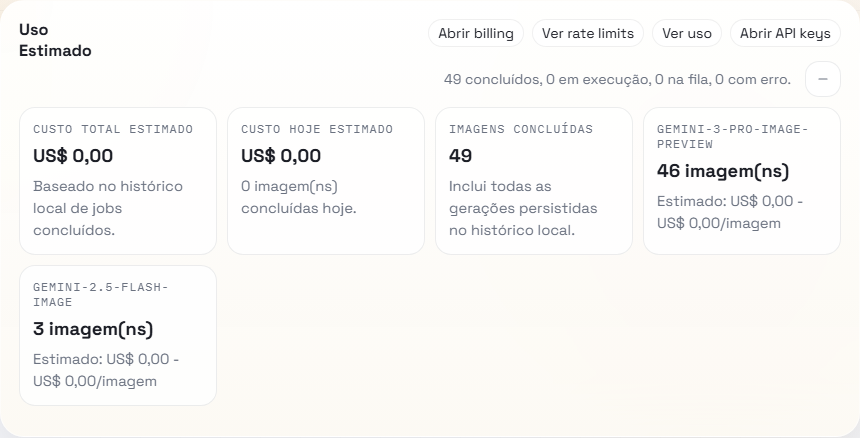
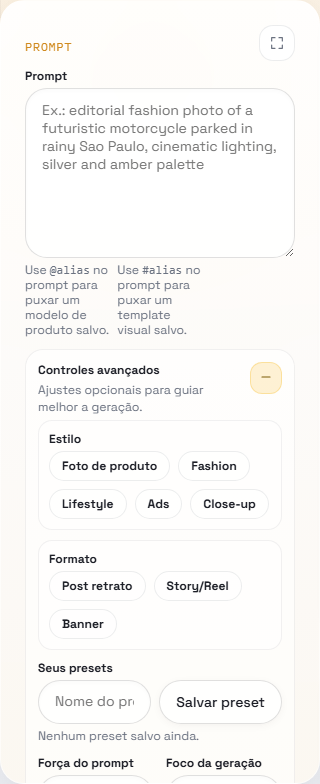
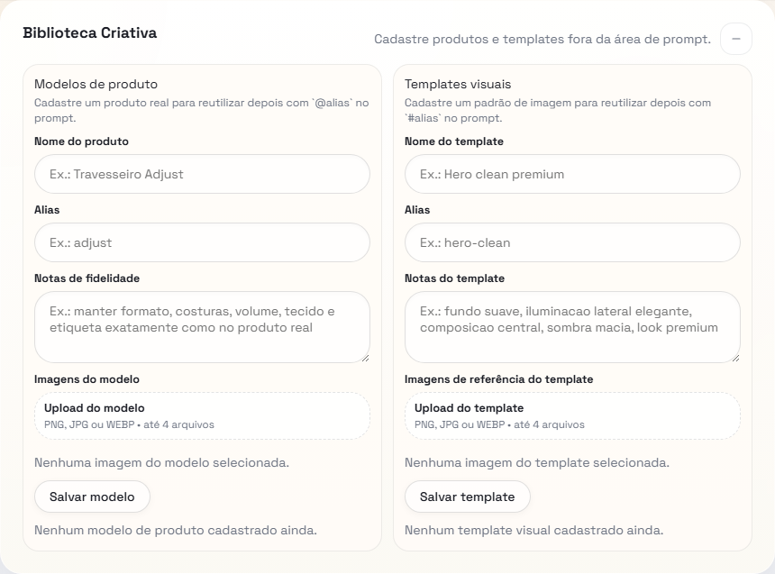
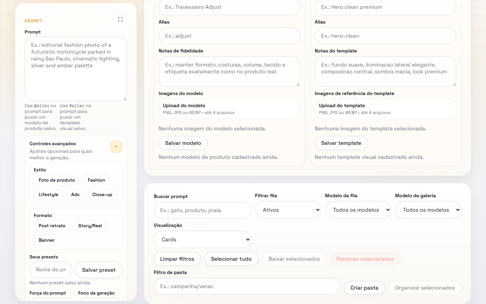
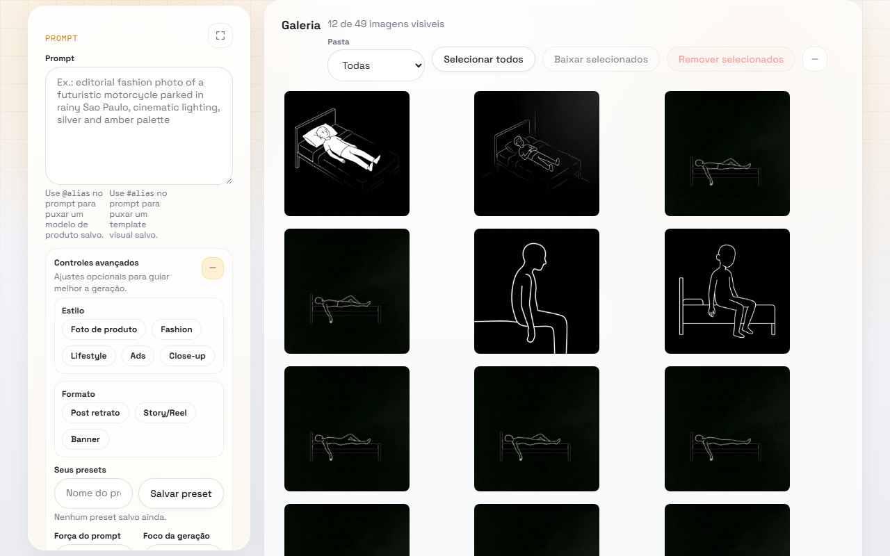

# Nano Banana Studio

**AI-powered product photography platform** — generate, edit, and manage product images at scale using Google Gemini, with on-device background removal and a full asset management pipeline.

> Built entirely without frontend frameworks: Vanilla JS + Vanilla CSS + Vite, backed by Node.js, Express 5, and SQLite.

---

## Screenshots

**Usage dashboard** — real-time cost tracking per model, with total and daily breakdowns.



**Prompt panel + Advanced controls** — style presets, aspect ratio, negative prompt, custom prompt options.



**Biblioteca Criativa** — reusable product models and visual templates, referenced in prompts via `@alias` / `#alias`.



**Queue + Gallery filters** — search, model filter, folder filter, and bulk operations toolbar.



**Gallery** — 12 of 49 generated images visible, with folder and model filters.



---

## What problem it solves

Product teams need professional product images continuously — for listings, ads, and social media. Traditional options are slow (photographers), expensive (SaaS tools per image), or low quality (generic AI wrappers).

Nano Banana Studio is a **local-first studio** that runs on your machine with your own API key, giving you full control over costs, privacy, and workflow. It is not a one-off generator: it is a repeatable pipeline with reusable product configurations, organized folders, and a cost tracker.

---

## Features

| Feature | Description |
|---|---|
| **Async job queue** | Up to 5 parallel generation jobs with configurable concurrency |
| **Multi-model support** | Gemini 2.5 Flash, Gemini 2.5 Pro, Imagen 3.0, and experimental models |
| **Reference images** | Attach up to 4 reference images per job (JPEG / PNG / WebP, max 15 MB each) |
| **Background removal** | On-device ML model via `@imgly/background-removal-node` — no extra API call or cost |
| **Canvas crop editor** | Browser-based crop tool with pixel-accurate buffer output |
| **Product models** | Save reusable product configurations (name, alias, reference images) once, attach to any job |
| **Image templates** | Save visual style presets and reuse them across multiple generation jobs |
| **Folder organization** | Target folder per job; bulk move and delete across the entire library |
| **Cost tracking** | Per-job estimated cost and cumulative usage summary grouped by model |
| **Prompt presets** | Persist and reload custom prompt option sets via localStorage |
| **Batch generation** | Submit multiple-quantity jobs in a single request |
| **Crash recovery** | Jobs stuck in `processing` on crash are automatically reset to `queued` on restart |

---

## Tech stack

**Backend**
- [Node.js](https://nodejs.org) 20+ with ES modules
- [Express 5](https://expressjs.com)
- [better-sqlite3](https://github.com/WiseLibs/better-sqlite3) — synchronous SQLite driver with WAL mode
- [@google/genai](https://www.npmjs.com/package/@google/genai) — Gemini API
- [@imgly/background-removal-node](https://www.npmjs.com/package/@imgly/background-removal-node) — on-device background removal

**Frontend**
- Vanilla JavaScript (no framework)
- Vanilla CSS — design tokens, glassmorphism, shimmer animations
- [Vite 8](https://vite.dev) — dev server with HMR and production bundler

**Persistence**
- SQLite with WAL mode via `better-sqlite3`

---

## Prerequisites

- Node.js 20 or later
- A [Google Gemini API key](https://aistudio.google.com/app/apikey) — a free tier is available

---

## Setup

```bash
# 1. Clone the repository
git clone https://github.com/your-username/nano-banana-studio.git
cd nano-banana-studio

# 2. Install dependencies
npm install

# 3. Configure environment
cp .env.example .env
# Open .env and set GEMINI_API_KEY
```

### Environment variables

| Variable | Required | Default | Description |
|---|---|---|---|
| `GEMINI_API_KEY` | **Yes** | — | API key from [Google AI Studio](https://aistudio.google.com/app/apikey) |
| `PORT` | No | `3000` | Port the Express server listens on |
| `QUEUE_CONCURRENCY` | No | `2` | Parallel generation workers (1–5) |
| `DATABASE_PATH` | No | `data/database.sqlite` | SQLite database file location |
| `DATABASE_JOURNAL_MODE` | No | `WAL` | SQLite journal mode |

---

## Running

```bash
# Development — Express API + Vite dev server with HMR, running concurrently
npm run dev
```

Open **http://localhost:5173**. Vite proxies all `/api/*` and asset routes to the Express server on port 3000 automatically.

```bash
# Production — build frontend first, then serve everything from Express
npm run build
npm start
```

Open **http://localhost:3000**.

---

## Usage

### Generating an image

1. Write a prompt in the generation panel
2. Optionally attach reference images and select a product model or template
3. Choose the AI model, aspect ratio, quantity, and target folder
4. Click **Generate** — the job is added to the queue and processed asynchronously
5. The gallery updates automatically as jobs complete

### Removing a background

1. Go to the **Cutouts** panel
2. Upload an image or pick one from the gallery
3. Click **Remove Background** — the ML model runs locally (no API request)
4. Download the resulting transparent PNG or use it as a reference in future jobs

### Saving reusable assets

- **Product models** — configure a product (name, alias, reference images) once and attach it to any generation job
- **Image templates** — save a visual style preset (prompt options + reference images) and reuse it across batches

---

## Project structure

```
├── server/
│   ├── app.js                # Express app setup and middleware
│   ├── routes.js             # All API route handlers
│   ├── queue.js              # Async job queue, lifecycle, and bulk operations
│   ├── media.js              # Asset operations: cutouts, crops, models, templates
│   ├── gemini.js             # Gemini API integration
│   ├── backgroundRemoval.js  # On-device background removal pipeline
│   ├── state.js              # In-memory state + SQLite DAOs
│   ├── db.js                 # Database initialization and schema
│   ├── config.js             # Environment config, pricing table, constants
│   └── utils.js              # Serialization, validation, file helpers
├── src/
│   ├── main.js               # Frontend state and event handlers
│   ├── dom.js                # Centralized DOM element references
│   ├── utils.js              # Client-side utilities (formatting, base64, toast)
│   ├── prompt-presets-store.js # LocalStorage preset persistence
│   └── styles.css            # Design system, tokens, animations
├── tests/
│   └── smoke.test.mjs        # API smoke tests with isolated per-run database
├── data/                     # Runtime artifacts — git-ignored
│   ├── database.sqlite
│   ├── references/
│   ├── cutouts/
│   └── crops/
├── generated/                # Generated image output — git-ignored
├── server.js                 # Entry point
├── vite.config.js
└── .env.example
```

---

## API reference

| Method | Endpoint | Description |
|---|---|---|
| `GET` | `/api/health` | Server status, API key presence, active jobs, queue depth |
| `GET` | `/api/jobs` | List all jobs with serialized metadata |
| `POST` | `/api/jobs` | Create one or more generation jobs |
| `DELETE` | `/api/jobs/:id` | Delete a completed or failed job and its files |
| `POST` | `/api/jobs/:id/cancel` | Cancel a queued job |
| `GET` | `/api/usage` | Cumulative cost summary grouped by model |
| `GET` | `/api/thumb?src=` | Generate a 256×256 WebP thumbnail on demand |
| `GET` | `/api/cutouts` | List background-removal results |
| `POST` | `/api/cutouts` | Process a new background removal |
| `DELETE` | `/api/cutouts/:id` | Delete a cutout and its file |
| `GET` | `/api/crops` | List saved crops |
| `POST` | `/api/crops` | Save a canvas crop |
| `DELETE` | `/api/crops/:id` | Delete a crop |
| `GET` | `/api/product-models` | List product models |
| `POST` | `/api/product-models` | Create or update a product model |
| `DELETE` | `/api/product-models/:alias` | Delete a product model |
| `GET` | `/api/image-templates` | List image templates |
| `POST` | `/api/image-templates` | Create or update an image template |
| `DELETE` | `/api/image-templates/:alias` | Delete an image template |
| `POST` | `/api/library/folders/assign` | Bulk-assign assets to a folder |
| `DELETE` | `/api/library/bulk` | Bulk delete across jobs, cutouts, and crops |

---

## Supported models

| Model ID | Type | Estimated cost |
|---|---|---|
| `gemini-2.5-flash` | Generation | ~$0.0000001 / image |
| `gemini-2.5-pro` | Generation | ~$0.000002 / image |
| `gemini-2.0-flash-exp` | Generation | Free (experimental) |
| `imagen-3.0-generate-002` | Generation | ~$0.03 / image |
| `imagen-3.0-fast-generate-001` | Generation | ~$0.03 / image |

Costs are tracked per job and displayed in the **Usage** panel.

---

## Tests

```bash
npm run test:smoke
```

Smoke tests start an isolated Express instance on a separate port with a temporary SQLite database, run all major API flows (CRUD, job lifecycle, cancellation, bulk operations), and clean up after themselves. Results are written to `tests/smoke-results.json`.

---

## License

Private — all rights reserved.
